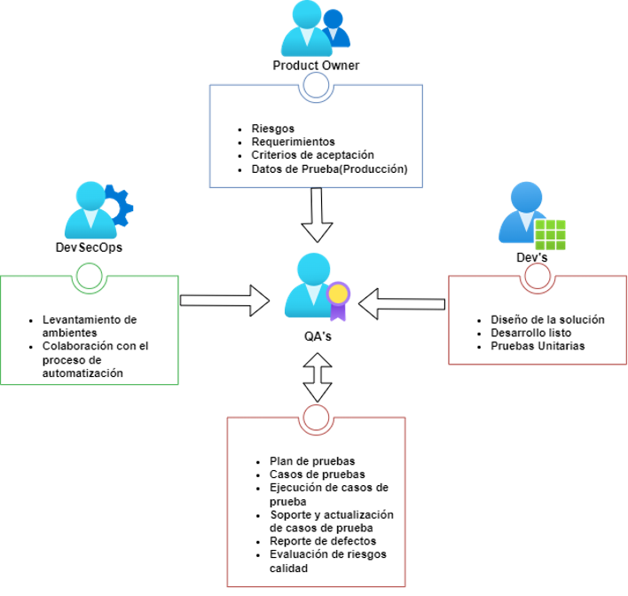
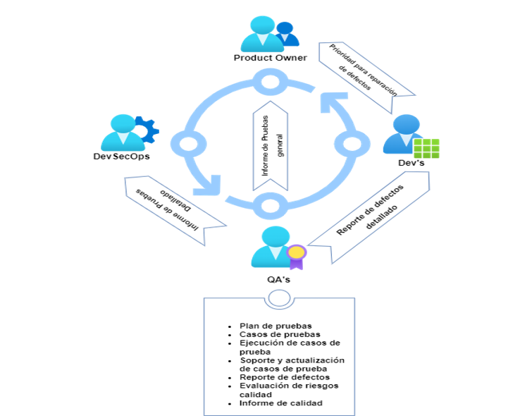
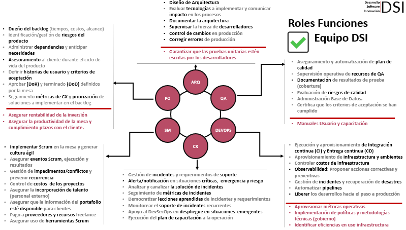
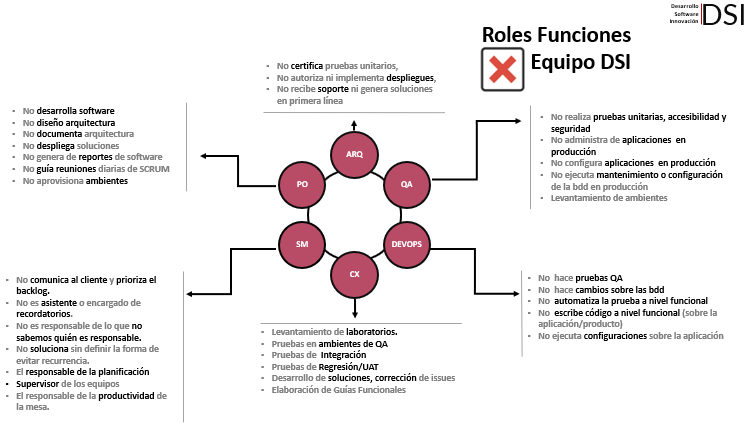
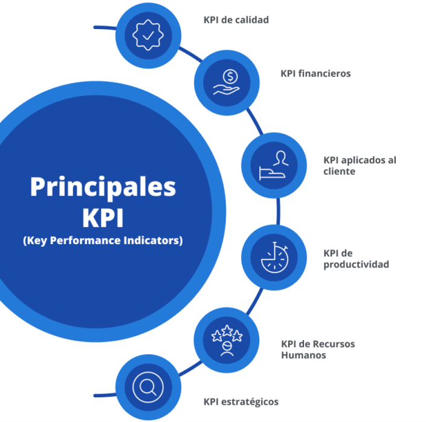
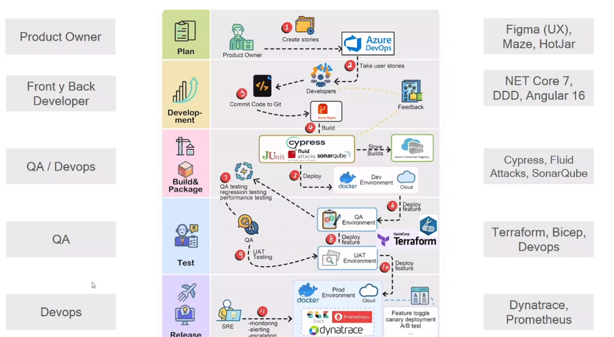

## Lineamientos 2024
## 1. Misión
Generar confianza y seguridad en el Grupo KFC, asegurando que sus sistemas de información cumplan con las condiciones adecuadas de calidad esperada. Además, permitir una producción más ágil y eficiente del software y los datos mediante la mejora y automatización de los controles en los procesos, estableciendo así una cultura de mejora y colaboración continua.

## 2. Visión
## El aseguramiento de calidad se centra en el software orientado a procesos y datos. Este proceso está presente en toda la cadena de construcción de los sistemas de información.  

Algunas características del aseguramiento de calidad son que abarca toda la cadena de producción, su objetivo principal es detectar errores durante el proceso de calidad de software y datos, los cuales serán compartidos con el área de Analítica de Datos. La medición es continua y todos los departamentos se encuentran involucrados.

### 3. Objectivos

**✓ Generar confianza y seguridad en los productos.**

**✓ Garantizar un control eficiente sobre la calidad del software y los datos.**

**✓ Contribuir con la reducción de costos.**

**✓ Optimizar los procesos.**

**✓ Fortalecer y mejorar la gestión.**

### 4. Funciones de Especialistas
| Esenciales                                                                                                         | Competencias de cargo                                                   |
|-------------------------------------------------------------------------------------------------------------------|--------------------------------------------------------------------------|
| Garantizar el cumplimiento de estándares y mejores prácticas de calidad en software y datos a lo largo del ciclo de vida del proyecto | Comunicación |
| Elaborar planes de prueba detallados con casos de prueba basados en criterios de aceptación y recursos para asegurar una cobertura adecuada de la calidad del software y los datos. |Trabajo en equipo, Pensamiento analítico |
| Realizar pruebas funcionales, de rendimiento y otras para validar la calidad del software y los datos.|Orientación al detalle |
| Detectar y supervisar defectos durante las pruebas, asegurando su correcta resolución. | Orientación al servicio,     Planificación y Organización |                                                                       
| Automatizar pruebas repetitivas y de regresión para aumentar la eficiencia y cobertura.| Potencial de Liderazgo|                                                              
                       
| Secundarias                      |
|-------------------------------|
| Revisar código y documentación para asegurar coherencia, cumplimiento de estándares y calidad. |
| Gestionar y resolver incidentes de calidad de software y datos de manera efectiva y rápida.         |
| Aplicar métricas de calidad para evaluar y mejorar el rendimiento del equipo y del producto.|
| Auditar datos para asegurar precisión, integridad y cumplimiento normativo. |
| Crear informes detallados sobre la calidad del software y datos para informar a las partes interesadas.  |
|Colaborar con desarrollo, operaciones y otros equipos para asegurar una adecuada cobertura de calidad en productos y datos.|
| Capacitar al equipo en metodologías de prueba, herramientas y mejores prácticas para mejorar habilidades y calidad. |
| Documentar procesos de prueba y estándares para asegurar cumplimiento en el equipo.|

### 5. Set Pruebas
| Cubierto      | Descripción   | No Cubierto     |
|-------------------|-------------------|-------------------|
| Pruebas Funcionales | Positivo/Negativo (Pruebas de caja negra, basadas en el comportamiento) |Estas pruebas evalúan el software sin conocer su implementación interna y pueden ser funcionales o no funcionales.| Pruebas de Accesibilidad  |
|Pruebas de Carga/Rendimiento|Identifican cuellos de botella y limitaciones para mejorar la escalabilidad y estabilidad del sistema.| Pruebas de seguridad |
| Pruebas de Usabilidad  |Evalúa la experiencia del usuario y la facilidad de uso del producto.|Navegadores Legacy |
|Pruebas de Confirmación/aceptación|Verificar que el producto satisfaga la necesidad. |   |
|Pruebas de Regresión|Verificar cambios para asegurar estabilidad y evaluar en nuevos entornos.| Pruebas Unitarias   |
|Pruebas de Humo| Revisión rápida para asegurar que el software inicia y no tiene defectos críticos. |  |
| Criterio de E2E |Validar el sistema en condiciones reales para identificar problemas de integración.|  |
| Calidad de Datos  | Asegurar que la información sea precisa, íntegra y consistente durante las pruebas. ||
| Pruebas de Caja Blanca  |Valida la correcta integración de todos los componentes del sistema.  | |

## 6. Aclaraciones
| Término         | Significado       |
|--------------------|--------------------|
| Pruebas de Confirmación   | Prueba relacionada con el cambio que confirma que el defecto reparado no vuelva a ocurrir.|
| Criterio de Entrada  |Conjunto de condiciones para comenzar oficialmente una tarea.|
| Criterio de Salida    |Conjunto de condiciones para finalizar oficialmente una tarea.|
| Pruebas de Carga    |Prueba de rendimiento bajo cargas variables, desde bajas hasta máximas.   |
| Confiabilidad y Estabilidad   | Rendimiento del sistema bajo condiciones y tiempo específicos.    |
| Pruebas de Regresión    |Prueba para detectar defectos en áreas no modificadas después de un cambio. |

## 7. Insumo Entrada

## 8. Insumo Salida

## 9. Roles Funciones Equipo DSI ✅

## 10. Roles Funciones Equipo DSI ❌

## 11. Resultados
 **“Lo que no se define no se puede medir. Lo que no se mide no se puede mejorar. Lo que no se mejora, se degrada siempre”.**

**¿Cómo definir KPI importantes?**

✓Necesita ser medible

✓Debe ser relevante

✓Necesita ser verificable

✓Debe mejorar la toma de decisiones

## 12. KPI QA
**Pruebas Creadas**

Cobertura de requisitos = (Número de requisitos cubiertos / Número total de requisitos) x 100

**Eficiencia**

Eficacia de los casos de prueba = (Número de defectos detectados / Número de casos de prueba ejecutados) x 100

**Casos de Prueba aprobados**

Cobertura de casos de prueba aprobados = (Número de pruebas ok / Número total de pruebas ejecutadas) x 100

**Casos de Prueba fallados**

Cobertura de casos de prueba fallados = (Número de pruebas KO/ Número total de casos de prueba fallidos) x 100

## 13. Cadena de Producción MAX POINT v2.0

