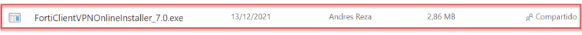
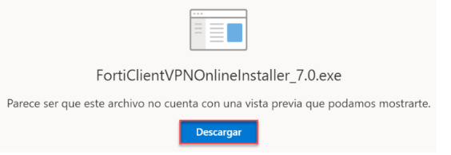
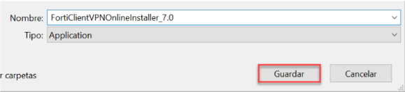
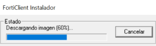

 **Te guiaremos a través del proceso los pasos a seguir para hacer la correcta instalación del FortiClientVPN**
## Descarga del instalador

1. Accede a la página de descarga: Visita https://grupokfc-my.sharepoint.com/:f:/g/personal/andres_reza_kfc_com_ec/Eis2tPfsa65OgVGxwdjZjgYB8EnuuKGmAoa2ZFF1pRmsBQ?e=5KAxFD para descargar el instalador.
2. Hacer clic sobre el instalador.

3. **Descarga el archivo:** Haz clic en descargar, para poder iniciar la intalación del archivo "FortiClienteVPNOnlineIstaller.exe" para iniciar la descarga.

4. Hacer clic en Guardar y abrir la aplicación descargada.

5. Esperar hasta que finalice la descarga..

6. Marcar la caja de selección y hacer clic en la opción Next por 2 ocasiones.

7. Hacer clic en la opción Install y esperar hasta que finalice la instalación.

8. Hacer clic en la opción Finish.

