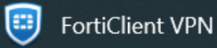
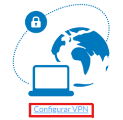
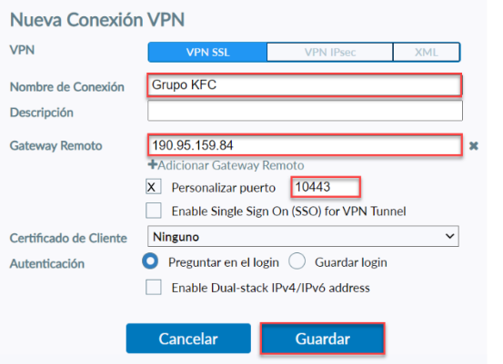
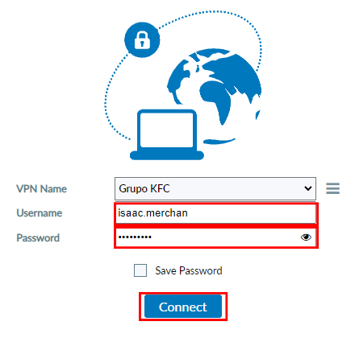
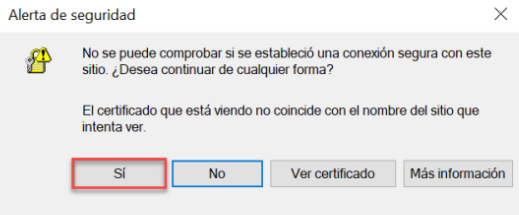
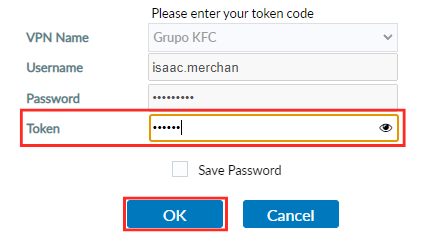
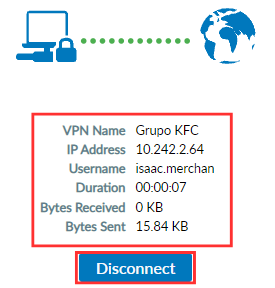

 **Te guiaremos a través del proceso de configuración de la aplicación FortiClient VPN. Aprenderás a conectar tu dispositivo  y a comenzar a trabajar en tus tareas.**
## Pasos para configurar FortiClient VPN
1. Iniciar la aplicación FortClient VPN.
- Busca la aplicación en tu computadora y has doble clic para iniciar

2. Hacer clic en la opción Configurar VPN.

3. Ingresar un nombre de Conexión, ingresar la dirección IP 190.95.159.84 y el puerto 10443 y hacer clic en la opción Guardar.

4. Ingresar las credenciales del usuario y hacer clic en la opción Conectar.

5. Va a aparecer una alerta de seguridad y luego hacer clic en la opción Si.

6. Recibirá un correo electrónico.

- El correo electrónico contendrá un código numérico, este sera el token.

6. Ingresar el código recibido.
- Se habilitará un nuevo campo llamado **"Token"**.
- Copia y pega el código del token obtenido en el correo electrónico en este campo.
- Dar clic en el botón en **"OK"**.

7. Cuando haya establecido la conexión aparecerá un aparatado similar a la siguiente imagen, al finalizar las actividades hacer clic en la opción Desconectar.

