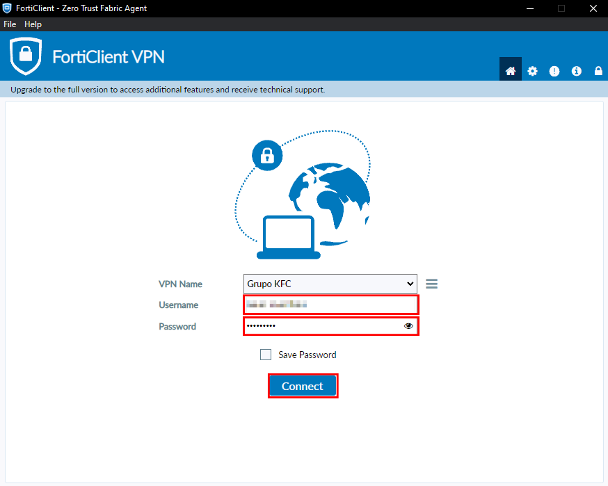
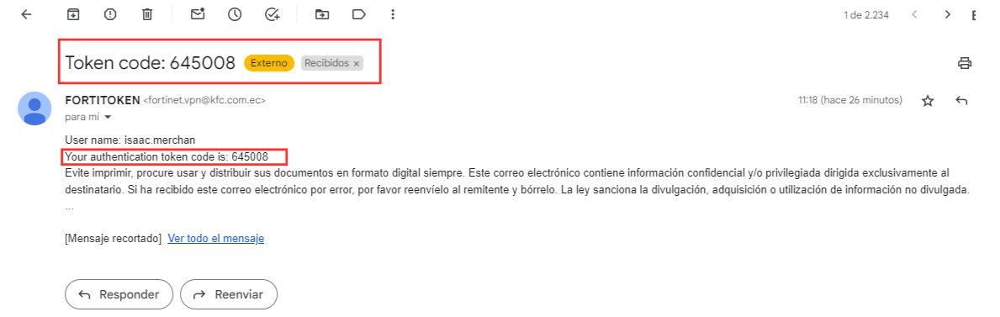
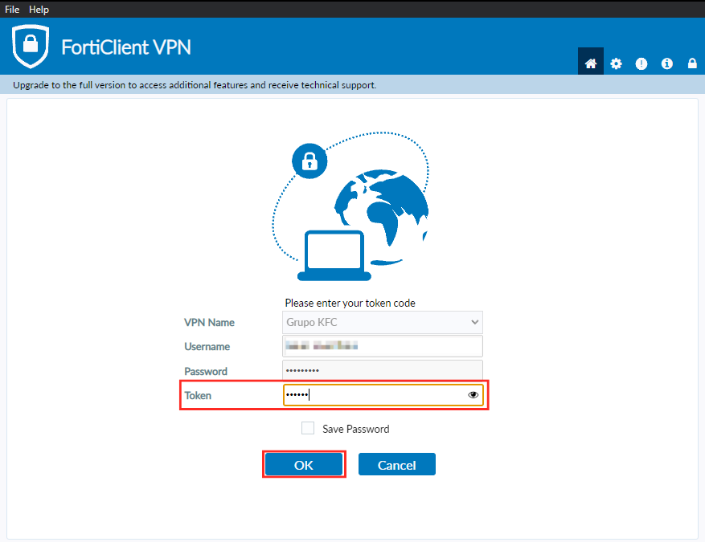

 **Te guiaremos a través del proceso de configuración inicial de tu ambiente MAXPOINT utilizando FortiClient VPN. Aprenderás a conectar tu dispositivo  y a comenzar a trabajar en tus tareas.**
## 1. Iniciar sesión el FortiClient VPN
**Pasos para configurar:**
1. Iniciar FortiClient.
- Localizar la aplicación.
- Dar clic para abrir la aplicación y esperar a que se ejecute.
2. Ingresar Credenciales.
- Ingresar el **Username**: (Proporcionado por el administrador) 
- Ingresar la **Password**: (Proporcionada por el administrador )
3. Dar clic en el Botón **"Connect"**.

5. Verificar el Correo Electrónico.
- Revisar la bandeja de entrada del correo electrónico.

- El correo electrónico contendrá un código numérico, este sera el token.

6. Ingresar el Token en FortiClient.
- Se habilitará un nuevo campo llamado **"Token"**.
- Copia y pega el código del token obtenido en el correo electrónico en este campo.
7. Dar clic en el botón en **"OK"**.
8. Esperar a que se complete la conexión.

9. Cuando haya establecido la conexión aparecerá un aparatado similar a la siguiente imagen.

