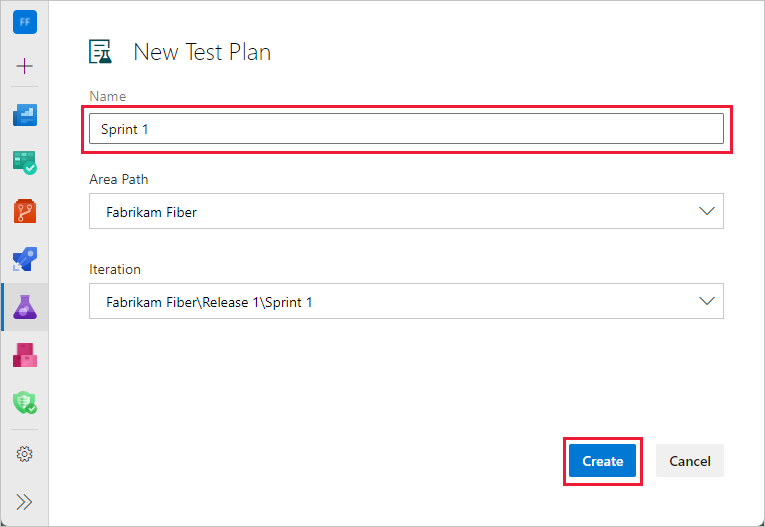

## Introduccion:¿Qué es Azure Test Plan?

Azure Test Plan es una herramienta clave para equipos DevOps, facilitando la gestión de pruebas y asegurando la calidad del software en cada etapa del desarrollo.

  

## A. Como generar Test Plans (Planes de prueba)

1.Inicie sesión en el proyecto de Azure DevOps y seleccione Planes de prueba de planes> de prueba.

  

2.Seleccione + Nuevo plan de prueba.

  

3.Escriba un nombre para el plan de prueba, compruebe que la ruta de acceso del área y la iteración se han establecido correctamente y, a continuación, seleccione Crear.

  

## B. Como generar Test suites (Conjuntos de pruebas)

1.Navega a Planes de prueba:
Una vez dentro de tu proyecto en Azure DevOps, dirígete a la sección de "Planes de prueba" y ve al que creaste.

3.Crea un nuevo conjunto de pruebas:
Dentro del plan de prueba, crea un nuevo conjunto de pruebas. Este conjunto será tu suite.

  

## C. Como generar test cases en el devops (Casos de prueba)

1.Agrega casos de prueba:
Puedes agregar casos de prueba existentes a la suite o crear nuevos directamente desde la suite.

  

Dentro de cada caso de prueba, especifique un conjunto de pasos de prueba con sus resultados esperados.

  

## D. Ejecución de pruebas
1.En el portal web, abra el proyecto y seleccione Planes de prueba Planes>de prueba.
2.Seleccione Mina o Todo, o use Filtrar por título para buscar el plan de prueba y seleccionarlo. Seleccione la pestaña Ejecutar .

  

3.Seleccione una o varias pruebas o todas las pruebas de un conjunto de pruebas. A continuación, seleccione Ejecutar.

  

4.Inicie la aplicación que desea probar.

  

5.Marque cada paso de prueba como superado o con errores en función de los resultados esperados.

  

## E. Crear o agregar un error
1.Cuando se produce un error en un paso, escriba un comentario y seleccione Crear error.

  

2.En el cuadro de diálogo Nuevo error , escriba un nombre para el error.

  

3.Puede asignar el error, escribir comentarios o vincular a otros problemas. Seleccione Guardar y cerrar cuando haya terminado. El caso de prueba está vinculado al error que creó.

  

## F. Guardar los resultados, cerrar la sesión y revisar los resultados
Después de completar las pruebas, guarde los resultados, cierre la sesión y revise los resultados de las pruebas.

1.Cuando haya ejecutado todas las pruebas, seleccione Guardar y cerrar. Todos los resultados de la prueba se almacenan en Azure Test Plans.

2.Vea el estado de las pruebas del conjunto de pruebas. Verá los resultados más recientes de cada prueba.

  

