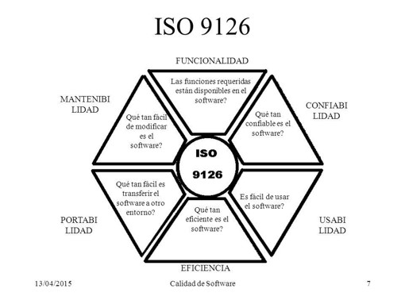
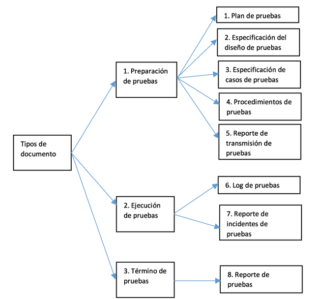
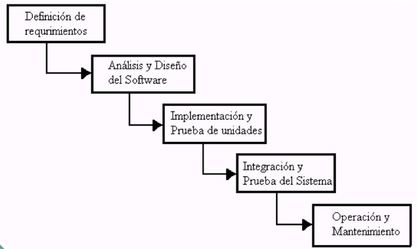
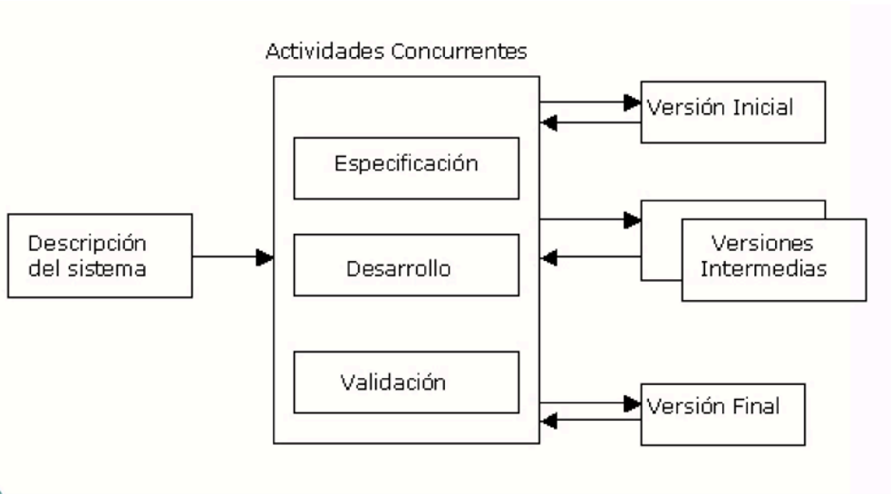
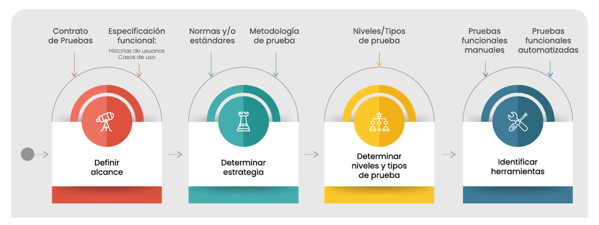
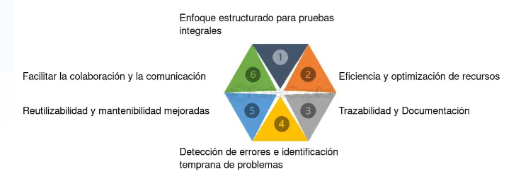
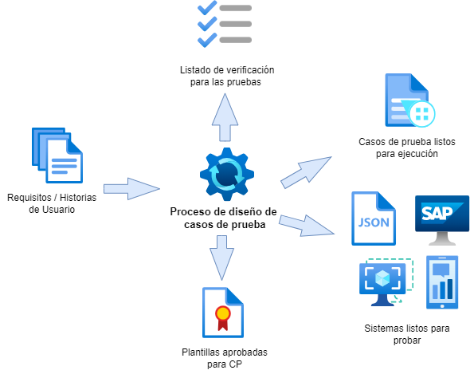
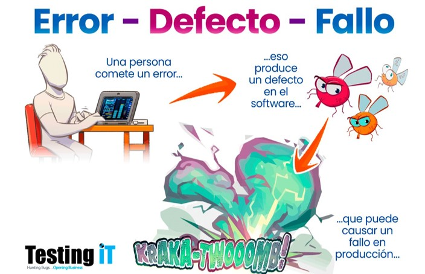
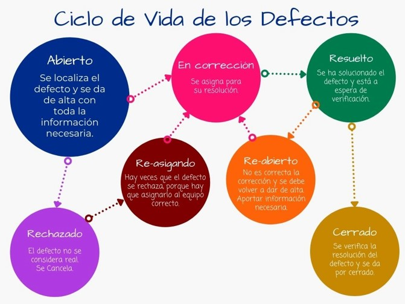

## 1. ¿Por qué Probar?
  
✔️Para evitar plazos y presupuestos incumplidos a causa de la insatisfacción de los usuarios, mala calidad que ocasiona baja productividad.

✔️Porque es una métrica importante para atraer clientes.

✔️Porque mejora los entregables y genera confianza al cliente de que los requisitos se cumplieron no solo a tiempo sino con calidad y sin errores.

## 2. ¿Quiénes deben probar o que se debe probar?
  
✔️Si la pregunta es quienes se diría que el programador o el que ejecuta el desarrollo debe evitar probar sus propios programas ya que no puede ser su propio juez.

✔️¡En el caso de que la pregunta sea que ! Decimos que se debe inspeccionar todo lo que compone un sistema desde el más bajo nivel al más alto que es la cara del cliente.

✔️Al generar mis casos de prueba se debe incluir tanto datos de entrada validos como no válidos , esperados como no esperados.

## 3. ¿Se debe probar todo?
  
✔️Es prácticamente imposible , ya que se pueden tener infinitas posibilidades.

✔️Se debe elegir ciclos de prueba eficientes y suficientes.

✔️Se sobrepasan los costos, por lo que en muchas ocasiones se prefiere no tener alguien de calidad en un equipo de trabajo ya que se puede volver un cuello de botella.

✔️Elegir lo más relevante de acuerdo con criterios de aceptación o checklist de validación

## 4. Estandares de pruebas
**ISO 9126**

Este modelo evalúa la calidad basada en medición y evaluación tomando la siguiente referencia

  

**IEEE 829**

Se basa en la documentación de pruebas generalmente en cómo y que entregables se tienen de soporte o evidencia de la ejecución de pruebas

 

 ## 5. Definiciones dentro del marco de calidad
| Término          | Descripción                                                               |
|------------------|---------------------------------------------------------------------------|
| **Prueba**       | Evaluación de componentes bajo condiciones específicas.                  |
| **Caso de Prueba** | Conjunto de entradas y condiciones que resultan en resultados esperados para garantizar calidad. |
| **Verificación** | Comprueba si una fase cumple con las condiciones establecidas.            |
| **Validación**   | Evaluación final de un sistema o componente ya completado.                |

## 6. Ciclo de vida de la calidad de software
**Cascada**
 
**Interactivo**
 

## 7. Plan de Pruebas 

**El plan de pruebas establece el alcance y cobertura según los requerimientos.**
 

## 8. Escenarios de Pruebas y Casos de Pruebas
|           Escenario        |    Caso   |
|-------------------|--------------------|
|Describe **QUÉ** hay que probar en una frase|Describe **QUÉ** y **COMÓ** probarlo paso a paso|
|**MENOR TIEMPO** invertido en su definición|**MAYOR TIEMPO** dedicado en la definición|
|Más **VERSÁTIL**, margen para la exploración|Más **ESTRUCTURADO** y planificado|
|**FACILITA LA DEFINICIÓN** de los casos de prueba|**FACILITA LA AUTOMATIZACIÓN** y la escalabilidad|

## 9. La importancia del diseño de caso de prueba
 

## 10. Escenarios de Pruebas y Casos de Pruebas
 

## 11. Definiciones dentro del marco de calidad

Por ejemplo:

Un error en la obtención de requisitosPuede conducir a un defecto al documentar un requisito que luego da como resultado que falle la aplicación o sistema.

 

## 12. Gestión de defectos
 

