## 1. Roles de calidad
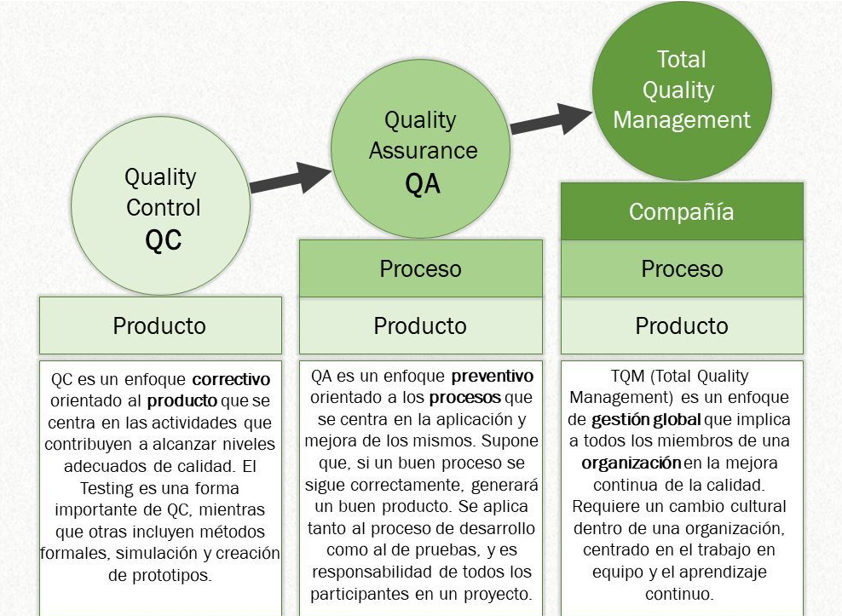

## 2. Niveles de pruebas
| Niveles | Pruebas |
|-----------|-----------|
|Unitarias|Probar componentes de forma individual|
|Integración|Probar todos los componentes integrados en una sola prueba|
|Sistema|Probar todo lo relacionado al sistema|
|Aceptación|Es la acción de validar todo el sistema al final del desarrollo|

## 3. Pruebas Unitarias
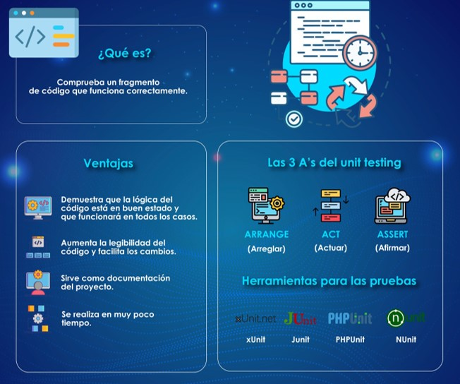

## 4. Pruebas de Integración
**Las pruebas de integración** aseguran que los módulos y servicios funcionen juntos correctamente y son más complejas que las pruebas unitarias.

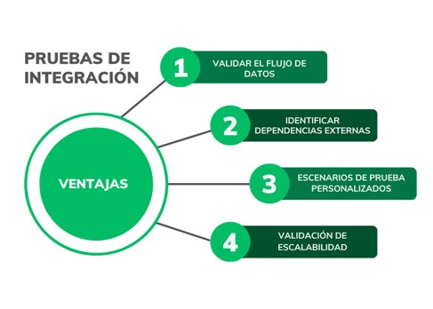

**-Prueba de UI:** para usabilidad y accesibilidad

**-Prueba de carga:** para asegurar el rendimiento

**-Inyección de SQL:** a travéz de componentes de UI para asegurar la seguridad

**-Pruebas de login:** con credenciales válidas en inválidad

Pruebas de Servicios o API´s es fundamental por diversas razones que impactan directamente en la calidad y la fiabilidad de los sistemas y aplicaciones. 

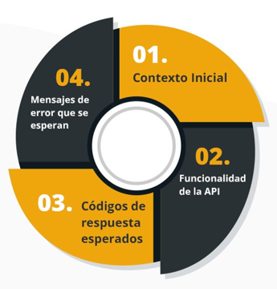

## 5. Pruebas de Sistema
| Pruebas Funcionales |Pruebas No Funcionales|
|-----------|-----------|
|De Integración|De Carga|
|De Sistema|De Estrés|
|De Sanidad|De Rendimiento|
|De Humo|De Estabilidad|
|De Interfaz|De Robustez|
|De Aceptación|De Usabilidad|
|De Regresión|De Volumen|
|Unitarias|
## 6. Pruebas Funcionales
**Las pruebas funcionales** verifican que una aplicación cumpla con los requerimientos de negocio, enfocándose en los resultados finales sin considerar los estados intermedios del sistema.
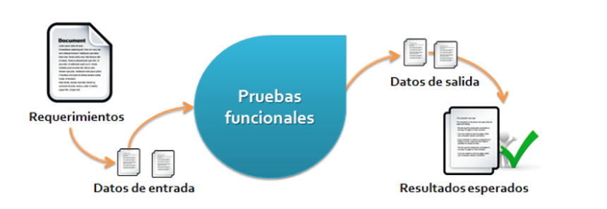

## 7. Pruebas End to End
**Las pruebas de punta a punta** simulan el uso completo del software para verificar que todos los flujos, desde tareas simples hasta procesos complejos, funcionen correctamente.

Estas pruebas verifican que los flujos que sigue un usuario trabajen como se espera, y pueden ser tan simples como:

-Cargar una página web

-Iniciar sesión o mucho más complejas

-Verificando notificaciones vía email

-Pagos en línea

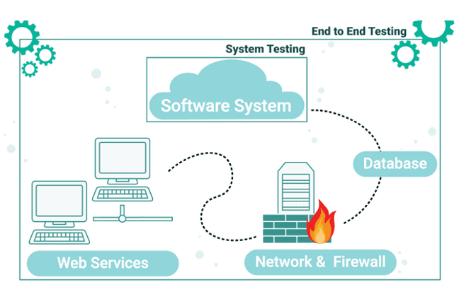

## 8. Pruebas de Humo
**Las pruebas de humo** verifican la funcionalidad básica de una aplicación de manera rápida después de una nueva versión para decidir si es apta para su despliegue en un nuevo entorno.

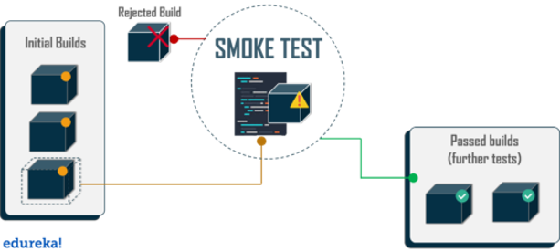

## 9. Pruebas de Regresión
**Las pruebas de regresión** aseguran que cambios recientes no afecten funcionalidades anteriores. No incluyen nuevas características; una falla indica un impacto negativo en lo que antes funcionaba.

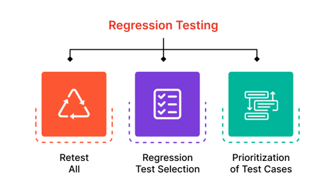

## 10. Pruebas de Usabilidad
**Las pruebas de usabilidad** evalúan si los nuevos usuarios pueden usar la aplicación intuitivamente. Las dificultades o confusiones deben ser documentadas.

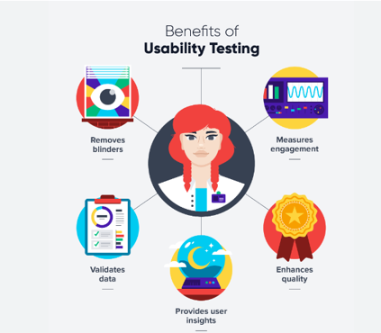

## 11. Pruebas de Rendimiento
**Las pruebas de rendimiento** evalúan cómo responde el sistema bajo alta carga y miden su fiabilidad, estabilidad y disponibilidad.

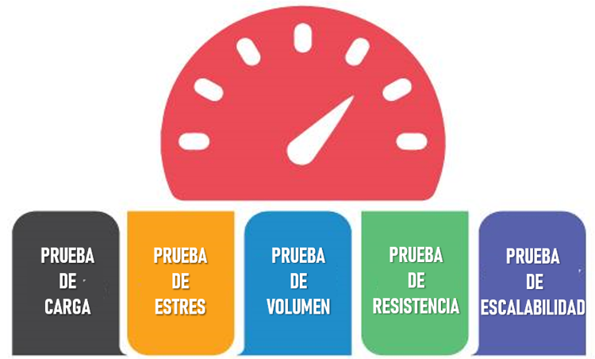

## 12. Pruebas de Aceptación
**Estas pruebas finales** implican que usuarios reales verifiquen si el software cumple con las tareas requeridas en un entorno real.

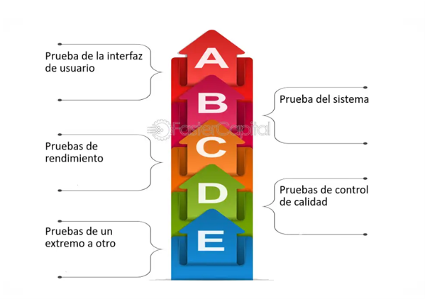
