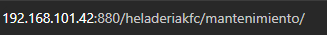
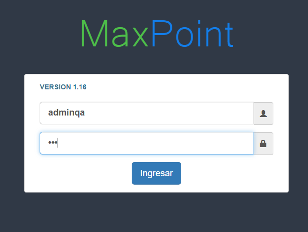
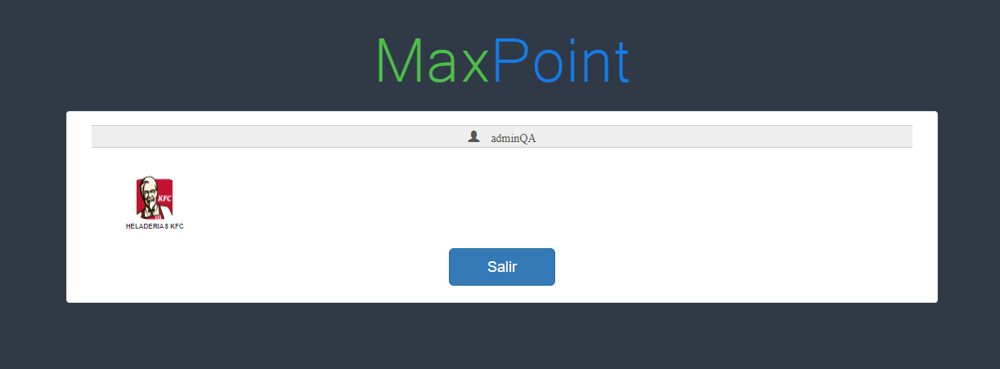

 **Te guiaremos a través del proceso los pasos a seguir para hacer una Configuración para una estación en MaxPoint**
## Verificar Datos.

 1. Accede a ambiente: Visita 192.168.101.42:880/heladeriakfc/mantenimiento/ 

<!--   -->

2. Ingresar a Maxpoint Backoffice e iniciar sesión como credenciales de un administrador

<!--  -->

3. Seleccionar una cadena.

<!--   -->

4. En el menú izquierdo seleccionar la opción **RESTAURANTE**

<!--  -->

5. Seleccionar la subopción **RESTAURANTE** y se despegara la información del restaurante.

<!--   -->

6. Seleccionar el Restaurante, luego el piso para terminar el area.

<!--  -->

7. Seleccionar la subopción **MESAS** como se muestra en la siguiente imagen.
<!--  -->

8. Aparecerá un modal el cual consta de Descripción en este ingresamos la descripción por ejemplo **"Mesa1"** y Mesas en el cual se selecciona el tipo de mesa y para finalizar hacer clic en el botón Aceptar.

<!--  -->

<!-- 9. Seleccionar la subopción **ESTACIÓN** como se muestra en la siguiente imagen

 -->
 

<!-- 10. Aparecerá la opción de Seleccionar Restaurante luego haz clic y selecciona el restaurante.-->

<!--  -->

 - Después de seleccionar el Restaurante aparecerá una lista con las estaciones existentes.
 - En caso de no existir estaciones procedemos a crear una, en la parte superior haz clic en **"Nuevo"**.
 <!--   --> 

 <!-- 11. Aparecerá un modal con toda la información.

  

- En el apartado **Ingrese IP** ingresamos la dirección IP la que nos proporciona el FortiClient.
- En el apartado **Nombre Estación** seleccionamos el nombre.
- En el apartado **Seleccione Menú** damos clic y aparecerá una lista con las opciones, la cual se escogerá de acuerdo a las necesidades.
- En el apartado **Medios Autorizados** damos clic y aparecerá una lista con los medios de autorización predeterminados y seleccionamos de acuerdo a las necesidades.
- Luego esta el apartado de **TID(Tarjeta de Credito)**, en el apartado de **Desasignar en** damos clic y se desplegará una lista con 2 opciones: PUNTO DE VENTA Y ADMINISTRACIÓN, seleccionamos según las necesidades en este caso seleccionamos PUNTO DE VENTA.
- En el apartado **Punto Emisión** ingresamos un valor numérico que haga referencia para un Punto de emisión.
- En el apartado **Pago Predeterminado** damos clic y aparecerá una lista con los Pagos Predeterminados, generalmente se selecciona **EFECTIVO**.
- Para finalizar en el apartado **Seleccione Mesa** damos clic y seleccionamos la mesa en este caso sera **Mesa2**
- Finalmente damos clic en el botón **Aceptar** para guardar la estación. 

 12. Seleccionar la subopción **IMPRESORA** como se muestra en la siguiente imagen.

- Después de seleccionar el Restaurante aparecerá una lista con las impresoras existentes.
 - En caso de no existir impresoras procedemos a crear una, en la parte superior haz clic en **"Nuevo"**. -->

<!-- 13. Aparecerá un modal con toda la información. -

 - En el apartado **Ingrese Nombre** ingrese el Nombre que vamos a ponerle a la impresora.
- En el apartado **Ingrese Descripción** ingrese la Descripción que vamos a poner.
- En el apartado **Seleccione Tipo de Impresora** dar clic y aparecerá una lista con los tipos de las impresoras y seleccionamos según las necesidades.
- En el apartado **Seleccione Estación a la que se conecta** dar clic y aparecerá uns lista con todas las cajas existentes y seleccionamos la estación según las necesidades, en este caso **CAJA02**
- Finalmente damos clic en el botón **Aceptar** para guardar la nueva impresora.
14.  -->