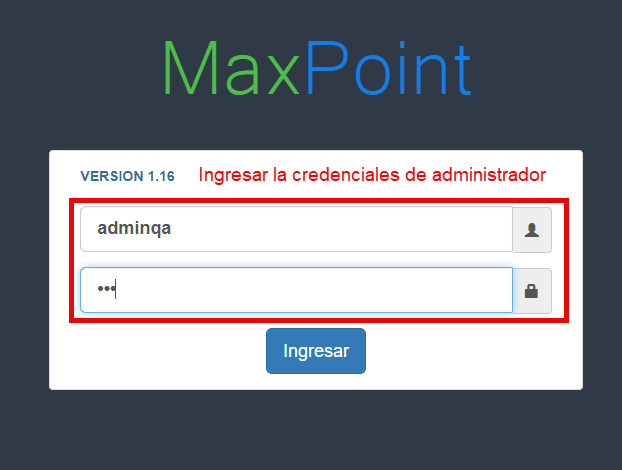
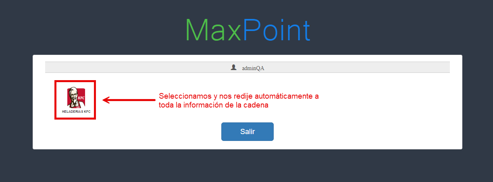
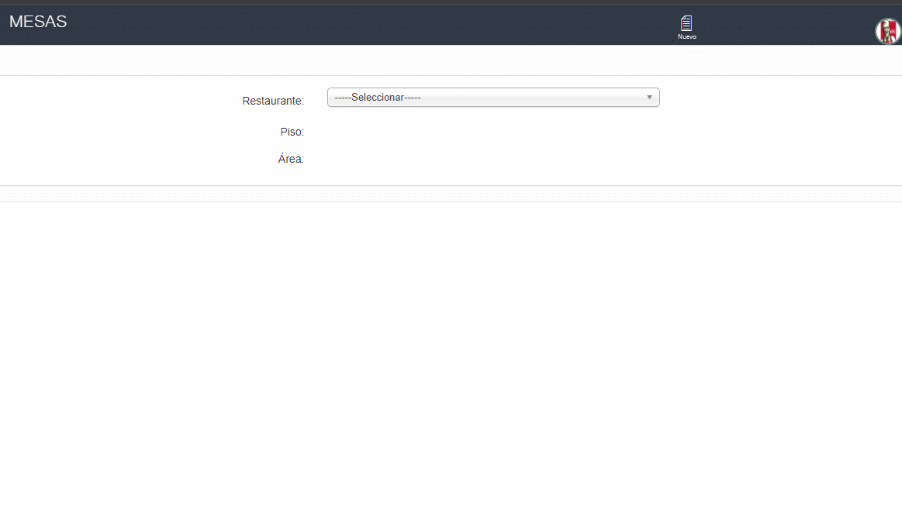

 **Te guiaremos paso a paso para configurar una estación**

## Primer paso: Verifica tu entorno de trabajo
1. Ingresar al ambiente: Dirígete a 192.168.101.42:880/heladeriakfc/mantenimiento/

   

2. Iniciar sesión en MaxPoint Backoffice: Utiliza credenciales de administrador.

  

3. Seleccionar una cadena.

   

## Segundo paso: Revisar la información del restaurante.

1. Ve al menú en la parte izquierda y da clic en la opción **RESTAURANTE**.

  

2. Aparecerán mas opciones, selecciona la subopción **RESTAURANTE** y aparecerán los detalles del restaurante.

  

 ## Tercer paso: Confirma si tienes mesas creadas. 

1. Seleccionar la opción **"MESAS"** para ver la lista de mesas existentes. Si la lista está vacía, significa que aún no has creado ninguna.

  

- Para aprender a crear una mesa, da clic en el siguiente enlace: [http://localhost:3000/docs/Crearmesa](http://localhost:3000/docs/Crearmesa)

 2. Elige tu restaurante, piso y área.

  

## Cuarto paso: Configura la Estación.

1.  Dar clic en la subopción **ESTACIÓN**, luego seleccionar el restaurante y aparecerá una lista con las estaciones existentes.
- Para aprender a crear una estación, da clic en el siguiente enlace: [http://localhost:3000/docs/Crearestacion](http://localhost:3000/docs/Crearestacion)

- Aparecerá una lista con todas las estaciones.
- Haz doble clic y se abrirá una ventana para editar la estación.
- Cambia la información según necesites.
- Haz clic en **Aceptar** para guardar los cambios, verás un mensaje confirmando que la estación se actualizo correctamente!

