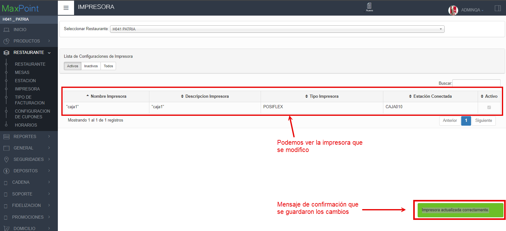
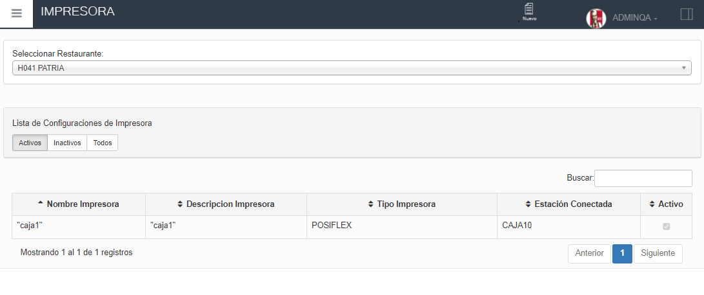

**Te guiaremos a través del proceso los pasos a seguir para poder configurar una impresora en MaxPoint**
## Verificar datos.
1. En el menú izquierdo seleccionar la opción **RESTAURANTE**

2. Seleccionar la subopción **IMPRESORA** y se despegara la información del restaurante.

   

3. Luego dar clic en la opción de **"Seleccionar Restaurante"**  selecciona el restaurante ente caso es **"H041 PATRIA"**.
 - Después de seleccionar el Restaurante aparecerá una lista con las impresoras existentes.
- En caso de no existir impresoras procedemos a crear una [Impresora](http://localhost:3000/docs/CrearImpresora).

 

4. Dar doble clic en la impresora que se va a modificar
- Se desplegará una ventana con la información
- Realizar las modificaciones necesarias.
- Dar clic en aceptar

5. En la pantalla **IMPRESORA** se observará la impresora modificada.

<!-- 12. Seleccionar la subopción **IMPRESORA** como se muestra en la siguiente imagen.

- Después de seleccionar el Restaurante aparecerá una lista con las impresoras existentes.
 - En caso de no existir impresoras procedemos a crear una, en la parte superior haz clic en **"Nuevo"**. -->
