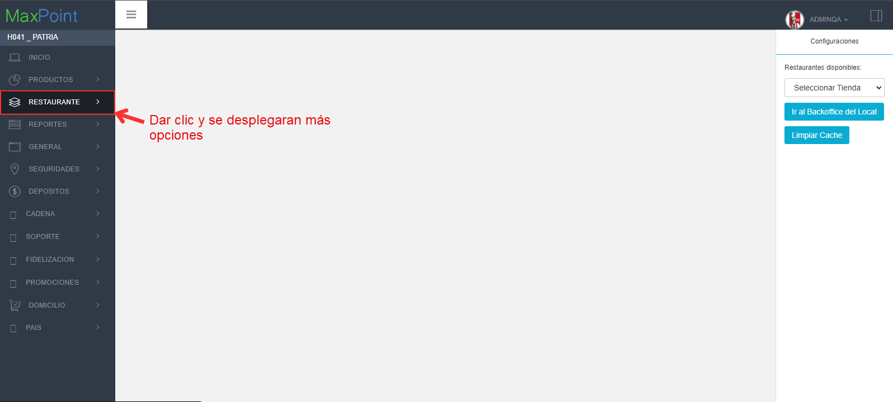
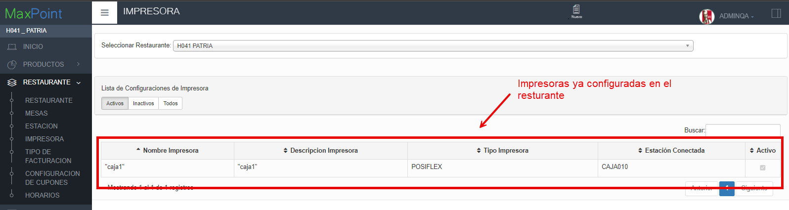

**Guía paso a paso para configurar tus impresoras.**

## Primer paso: Revisar la información del restaurante.
1. Ve al menú en la parte izquierda y da clic en la opción **RESTAURANTE**.

  

2. Aparecerán mas opciones, selecciona la subopción **RESTAURANTE** y aparecerán los detalles del restaurante.

  
## Segundo paso: Verificar Impresoras
1. Haz clic en la subopción **IMPRESORA** y se despegara la información del restaurante.

   

2. Dar clic en la opción de **"Seleccionar Restaurante"** y seleccionamos el restaurante: **"H041 PATRIA"**.

   
 
3. Se mostrará una lista de las impresoras configuradas para ese restaurante.

 

## Tercer paso configurar impresora
- **Si no hay impresoras:** Da clic en el enlace para crear una nueva: [http://192.168.101.42:880/documentacion/docs/CrearImpresora](http://192.168.101.42:880/documentacion/docs/CrearImpresora).
1. Si quieres modificar una impresora ya creada sigue estos pasos:
- Haz doble clic sobre la impresora que deseas editar.
- Se abrirá una ventana donde podrás cambiar la configuración.
- Haz clic en **Aceptar** para guardar los cambios, verás un mensaje confirmando que la estación se actualizo correctamente!

