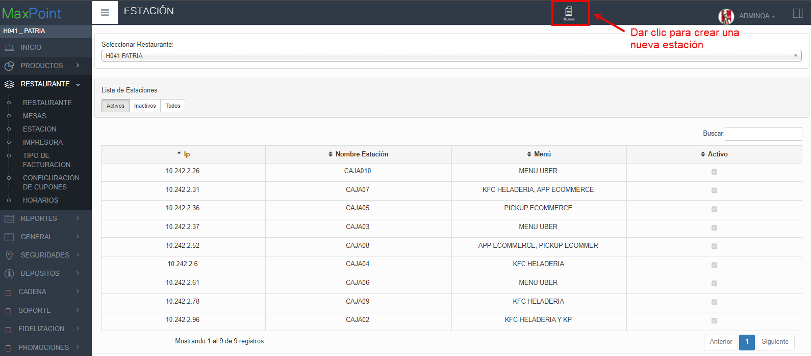

 **Te guiaremos a través del proceso los pasos a seguir para hacer una crear una estación en MaxPoint**

1. En el menú izquierdo seleccionar la opción **RESTAURANTE**

2. Seleccionar la subopción **RESTAURANTE** y se despegara la información del restaurante..

   

3. Seleccionar la subopción **MESAS** y revisa si existen mesas existentes en caso contrario revisa el siguiente link para aprender a crear una mesa [Link](http://localhost:3000/docs/Crearmesa)

## Crear Estación.
4. En el menú izquierdo seleccionar la opción **RESTAURANTE**

5. Seleccionar la subopción **ESTACIÓN** y aparecerá la opción que viene por defecto "Este sera el nombre del ambiente en el que estemos trabajando".

6. Luego dar clic en la opción de **"Seleccionar Restaurante"**  selecciona el restaurante ente caso es **"H041 PATRIA"**.

 - Después de seleccionar el Restaurante aparecerá una lista con las estaciones existentes.

 

 - En caso de no existir estaciones procedemos a crear una, en la parte superior haz clic en **"NUEVO"**.

 7. Se abrirá una ventana donde deberás completar los siguiente datos:
- **Ingrese IP:** Escribir la dirección IP que te proporciona  FortiClient VPN.
- **Nombre estación:** Seleccionar el número de la estación correspondiente para identificarla.
- **Seleccione Menú y Medios de autorizadores** Seleccionar las opciones que mejor se adapten a tus necesidades, cuando se marque una opción de Medios Autorizadores se habilitara un campo en la opción TID.
- **TID(Tarjeta de Credito):** Ingresar los dígitos de la tarjeta en este caso como es un ejemplo  serán **"H04192"**
- **Desasignar en:** Se desplegará una lista con 2 opciones: PUNTO DE VENTA Y ADMINISTRACIÓN, seleccionar según las necesidades en este caso será **PUNTO DE VENTA**.
- **Punto Emisión** Ingresar un valor numérico de tres dígitos en este ejemplo será **040**.
- **Pago Predeterminado** Al dar clic aparecerá una lista con los Pagos Predeterminados, generalmente se seleccionará **EFECTIVO**.
- **Seleccione Mesa** Seleccionar la mesa correspondiente en este caso será **Mesa9**
- Finalmente dar clic en el botón **Aceptar** para guardar la nueva estación o caja.

8. En la pantalla **ESTACIÓN** aparecerá la nueva estación o caja que creamos.

