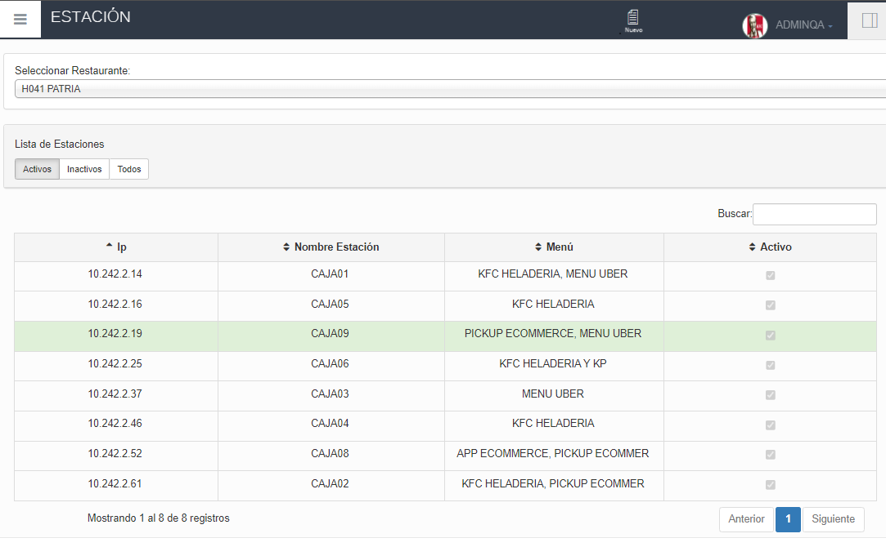

 **Sigue estos pasos para crear una nueva estación**

## Primer paso: Revisar la información del restaurante.

1. En el menú izquierdo seleccionar la opción **RESTAURANTE**

2. Seleccionar la subopción **RESTAURANTE** y se despegara la información del restaurante.

   

## Segundo paso: Confirma si tienes mesas creadas.

1. Seleccionar la subopción **MESAS** y revisa si existen mesas creadas. Si no hay mesas, da clic en el siguiente enlace para aprender a crear mesas: [http://localhost:3000/docs/Crearmesa](http://localhost:3000/docs/Crearmesa)

## Tercer paso: Crear una estación.

1. En el menú izquierdo seleccionar la opción **RESTAURANTE**

2. Dar clic en la subopción **ESTACIÓN**, luego seleccionar el restaurante.

3. Después de seleccionar el Restaurante aparecerá una lista con las estaciones, para **crear** una nueva estación dirígete a la parte superior haz clic en **"NUEVO"**.

4. Se abrirá una ventana donde deberás completar los siguiente datos:
- **Ingrese IP:** Escribir la dirección IP que te proporciona  FortiClient VPN.
- **Nombre estación:** Seleccionar el número de la estación correspondiente para identificarla.
- **Seleccione Menú y Medios de autorizadores** Seleccionar las opciones que mejor se adapten a tus necesidades, cuando se marque una opción de Medios Autorizadores se habilitara un campo en la opción TID.
- **TID(Tarjeta de Credito):** Ingresar los dígitos de la tarjeta en este se puede ingresar cualquier valor en este caso será: **"H04192"**
- **Desasignar en:** Se desplegará una lista con 2 opciones: PUNTO DE VENTA Y ADMINISTRACIÓN, seleccionar según las necesidades en este caso será **PUNTO DE VENTA**.
- **Punto Emisión** Ingresar un valor numérico de tres dígitos en este ejemplo será **040**.
- **Pago Predeterminado** Al dar clic aparecerá una lista con los Pagos Predeterminados, generalmente se seleccionará **EFECTIVO**.
- **Seleccione Mesa** Seleccionar la mesa correspondiente según la el nombre  en este caso será **Mesa9**
- Finalmente dar clic en el botón **Aceptar** para guardar la nueva estación o caja.

5. En la pantalla **ESTACIÓN** aparecerá la nueva estación o caja que creamos.

