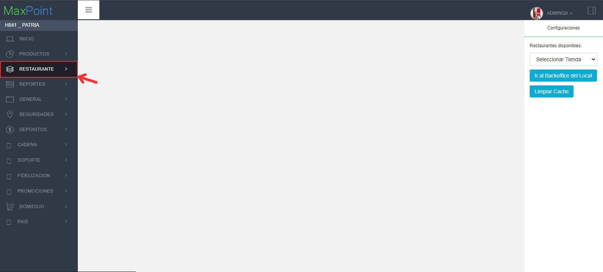
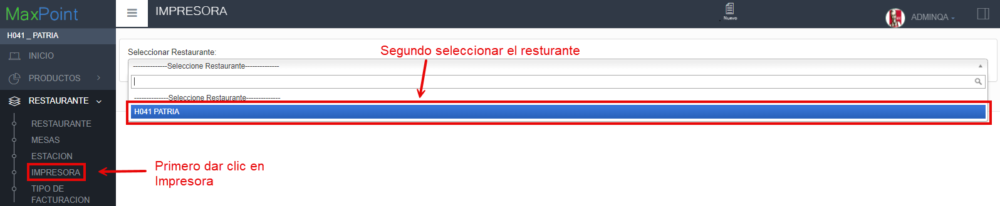
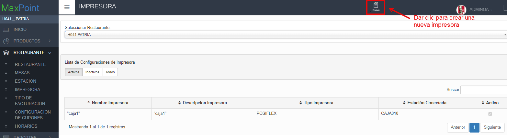
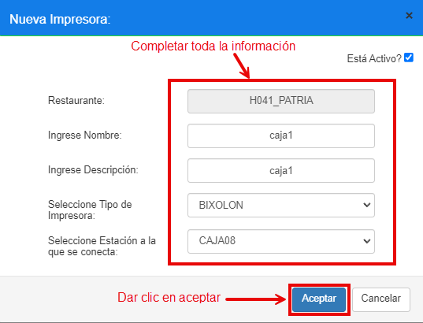
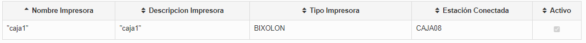

**Te guiaremos a través del proceso los pasos a seguir para poder configurar una impresora en MaxPoint**

1. En el menú izquierdo seleccionar la opción **RESTAURANTE**

2. Seleccionar la subopción **IMPRESORA** y se despegara la información del restaurante..

   

3. Luego dar clic en la opción de **"Seleccionar Restaurante"**  selecciona el restaurante ente caso es **"H041 PATRIA"**.
 - Después de seleccionar el Restaurante aparecerá una lista con las impresoras existentes.

 

 - Procedemos a crear una nueva impresora, en la parte superior haz clic en **"NUEVO"**.

4. Se abrirá una ventana donde deberás completar los siguiente datos.

 - **Ingrese Nombre** Escribir el nombre de la impresora.
- **Ingrese Descripción**  Agregar una breve descripción.
- **Seleccione Tipo de Impresora** Seleccionar el tipo de impresora de la lista según las necesidades.
- **Seleccione Estación a la que se conecta** Al dar clic se desplegará una lista con todas las cajas o estaciones existentes y seleccionamos a la que se va a conectar, en este caso **CAJA08**
- **Aceptar** Dar clic en el botón para guardar la nueva impresora.

5. En la pantalla **IMPRESORA** aparecerá la nueva impresora que creamos.

