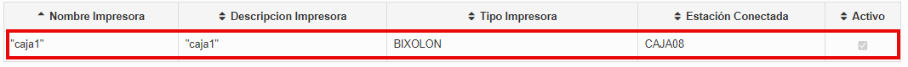

**¡Sigue estos pasos para crear una nueva impresora!**

## Primer paso: Revisar la información del restaurante.

1. En el menú izquierdo seleccionar la opción **RESTAURANTE**

2. Seleccionar la subopción **RESTAURANTE** y se despegara la información del restaurante.

   

## Segundo paso: Crear una impresora
1.  En el menú izquierdo seleccionar la opción **RESTAURANTE**

2. Dar clic en la subopción **IMPRESORAS** ,luego seleccionar el restaurante..

   

3. Después de seleccionar el Restaurante aparecerá una lista con las impresoras, para **Crear** una nueva impresora dirígete a la parte superior haz clic en **"NUEVO"**.

  

4. Se abrirá una ventana donde deberás completar los siguiente datos.

- **Ingrese Nombre** Escribir el nombre de la impresora.
- **Ingrese Descripción**  Agregar una breve descripción.
- **Seleccione Tipo de Impresora** Seleccionar el tipo de impresora de la lista según las necesidades.
- **Seleccione Estación a la que se conecta** Al dar clic se desplegará una lista con todas las cajas o estaciones existentes y seleccionamos a la que se va a conectar, en este caso **CAJA08**
- **Aceptar** Dar clic en el botón para guardar la nueva impresora.

5. En la pantalla **IMPRESORA** aparecerá la impresora que se acabó de crear.

