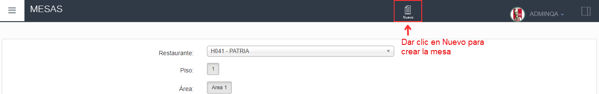

1. En el menú izquierdo seleccionar la opción **RESTAURANTE**

2. Seleccionar la subopción **MESAS** y se despegara la información.

 

3. Seleccionar el Restaurante, luego seleccionamos el piso para terminar seleccionamos el area.

4. Para crear una nueva mesa nos dirigimos a la parte superior buscamos el apartado **"NUEVO"**.

5. Se mostrará un cuadro con dos campos:
- Descripción: Ingresa aquí un nombre o descripción distintiva para identificar el elemento. Por ejemplo, **"Mesa 9"**.
- Tipo de mesa: Selecciona el tipo de mesa correspondiente de una lista desplegable.
- Al hacer clic en el botón **"Aceptar"**, se confirmará la información ingresada."

 

6. Finalmente en la pantalla aparecerá la mesa que acabamos de crear.

