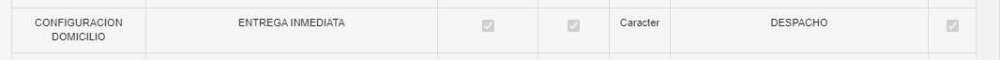

## 1. Error WS SERVIDOR al iniciar un periodo

Este error se debe a que en la tienda se tiene activa la Política **Transferencia de venta**. Para solucionar el error se debe seguir los siguientes pasos:
1. Ingresar a Maxpoint Backoffice e iniciar sesión como credenciales de un administrador 
2. Seleccionar una cadena.
3. En el menú izquierdo seleccionar la opción RESTAURANTE
4. Seleccionar la subopción RESTAURANTE como se muestra en la siguinte imagen.

5. Dar doble clic en el registro del restaurante y seguidamente se mostrará una pantalla modal.
6. En la pantalla modal dirigirse a la pestaña políticas de configuración y buscar la política **TRANSFERENCIA DE VENTA** 
7. Esta política debe de estar deshabilitada tal como se muestra en la siguiente imagen: 

## 2. No se muestran los pedidos domicilio en pantalla.

Cuando los pedidos no se muestran en pantalla pueden deverse a algunas situaciones a continuación se listan las posibles razones.
### 1. La política entrega inmediata tiene el valor INMEDIATA

La razón de que el pedido no se muestre en la pantalla **Pedidos Pendientes** puede ser debido a que la política del restaurante llamada **ENTREGA INMEDIATA** tiene el valor **INMEDIATA**. 
Cuando tiene el valor inmediata el pedido domicilio no se muestra en la pantalla de Pedidos Pendientes. Para resolver esto se debe de cambiar al valor **DESPACHO** o **PARCIAL**
