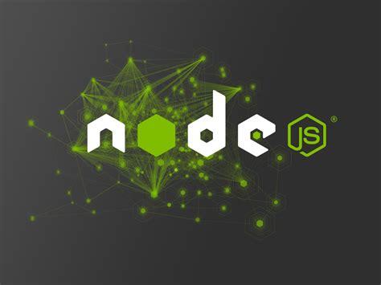

## 1. Pre-requisitos para la instalación de Cypress:

#### 1.	Node.js:

 Cypress se basa en Node.js, por lo que es necesario tener Node.js instalado en tu sistema. Puedes descargar e instalar Node.js desde su sitio web oficial: nodejs.org.

#### 2.	NPM:

  NPM es el administrador de paquetes de Node.js y se instala automáticamente junto con Node.js. Asegúrate de tener la última versión de NPM instalada ejecutando el siguiente comando en tu terminal:
 npm install -g npm@latest

## 2. Instalación de Cypress.io:
 1.	Iniciamos un proyecto Node: Desde la ruta en donde se realizarán las pruebas, inicializamos un proyecto Node desde la terminal, con su comando:
 npm init 

2.	Instalación a través de NPM: Ejecuta el siguiente comando en tu terminal para instalar Cypress.io como una dependencia de desarrollo en tu proyecto:
 npm install cypress --save-dev

 3.	Descarga directa: También puedes descargar Cypress.io directamente desde su sitio web oficial: cypress.io. Después de descargarlo, descomprime el archivo y coloca la carpeta en la ubicación deseada en tu sistema.
 
 Una vez que hayas instalado Cypress.io, puedes comenzar a utilizarlo para realizar pruebas de software. Puedes encontrar más información sobre cómo utilizar Cypress.io en su documentación oficial: https://docs.cypress.io/guides/overview/why-cypress

