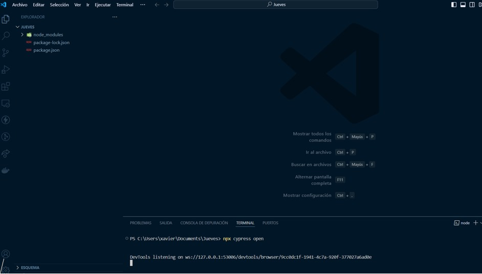
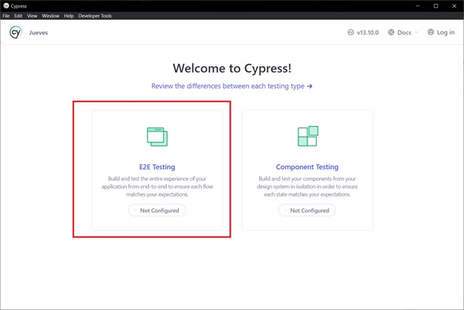
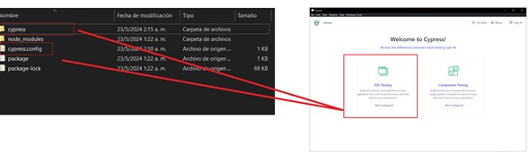
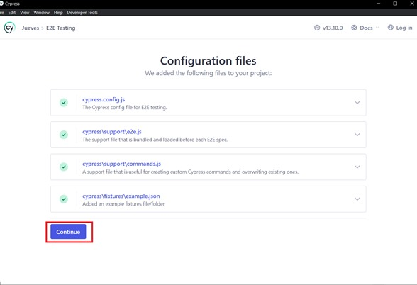
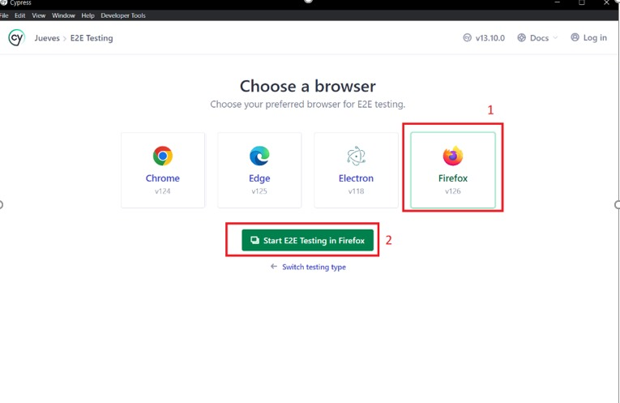
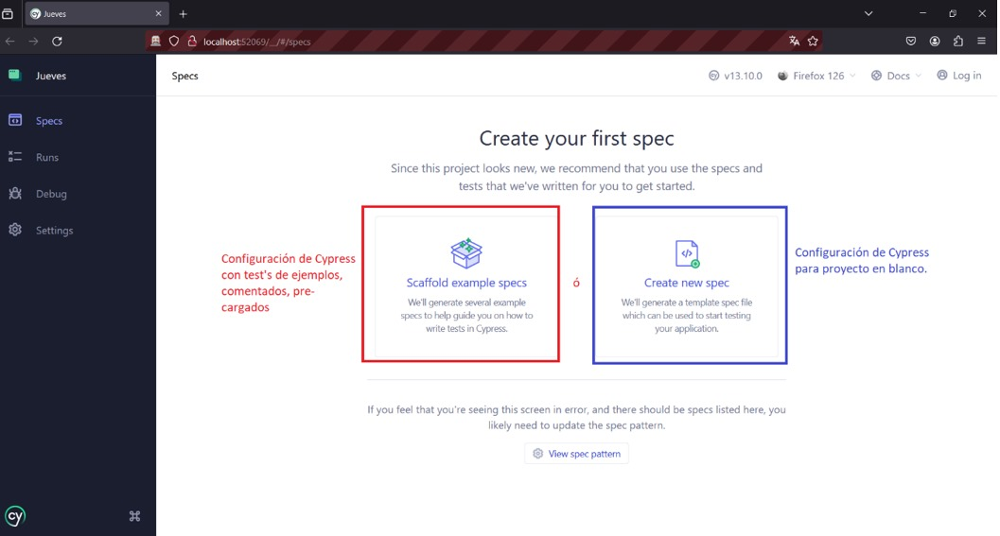
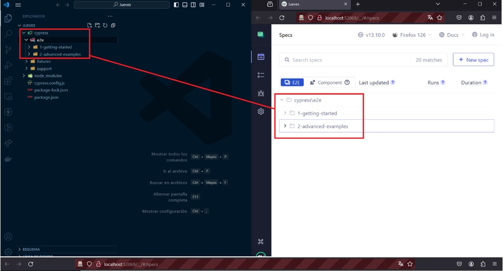
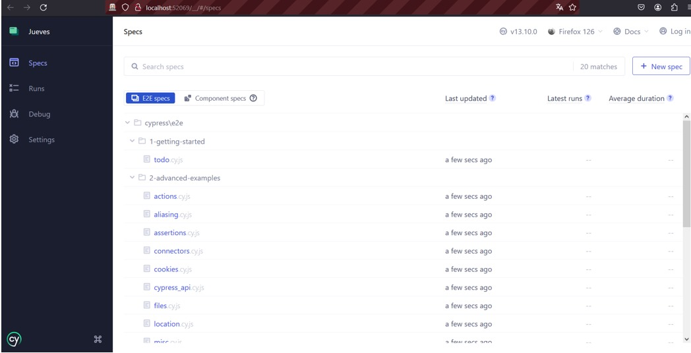

## 1. Como confirurar por primera vez cypress 

#### 1.	En el directorio en dónde se inicializó el proyecto, abrir CMD ó PowerShell y correr el comando de inicialización de Cypress:
#### a.	npx cypress open:
 
 

#### 2.	Se despliega la interfaz de configuración de Cypress, escogemos la opción E2E Testing:

#### a. Al momento de escoger esta opción, en la ruta del proyecto, se crea la estructura del proyecto Cypress:

#### 3. En la siguiente pantalla, muestra los archivos de configuración básica que se van a guardar en el proyecto. Dar click en “Continue”:

#### 4.	Se despliega la interfaz para escoger el navegador que usaremos como motor de pruebas. Dar click en el navegador de preferencia (Firefox para pruebas de Maxpoint), seguidamente click en el botón “Start E2E testing in Firefox”:

#### 5.	Se despliega la interfaz para escoger la configuración de la carpeta de test’s (./e2e). En la imagen adjunta, el recuadro rojo ofrece la opción de crear configurar un conjunto de test de ejemplos comentados de cypress (recomendado para personas que usan la herramienta por primera vez):

#### 6.	Por último, se muestra en la interfaz de Cypress el directorio de pruebas (./e2e):

#### a.  en caso de haber escogido la configuración de test’s de ejemplo, se mostrarán en esta pantalla, de lo contrario, en un principio, se mostrará en blanco hasta que comiences a crear test plans.

