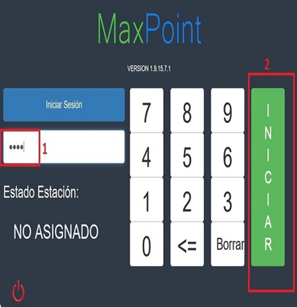
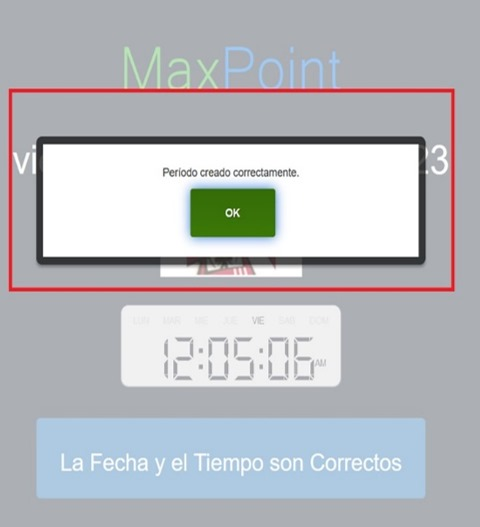
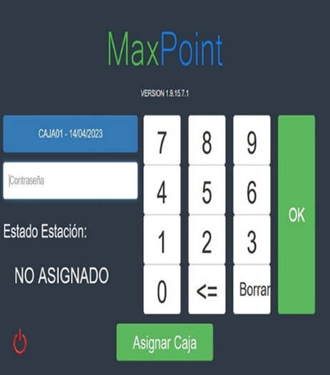

# TEST INICIO DE PERIODO 
 ## 1. Ambiente:
 #### Maxpoint
## 2. Requisitos Previos:
 #### Credenciales de Usuario Administrador
 #### Asignarse una estación válida

 ### En la pantalla de inicio de Sesión: 
 Ingresar las credenciales de Administrador y dar clic en el botón "Iniciar“
 

### En la siguiente pantalla, verificar la fecha y la hora del inicio de sesión, y dar clic en "La fecha y el tiempo son correctos" 

### En el modal a continuación, con el mensaje "Periodo creado correctamente", dar clic en "OK“

### Con el periodo iniciado correctamente, la interfaz se refresca y devuelve al usuario a la pantalla principal, en donde podrá asignar un cajero a la estación.

