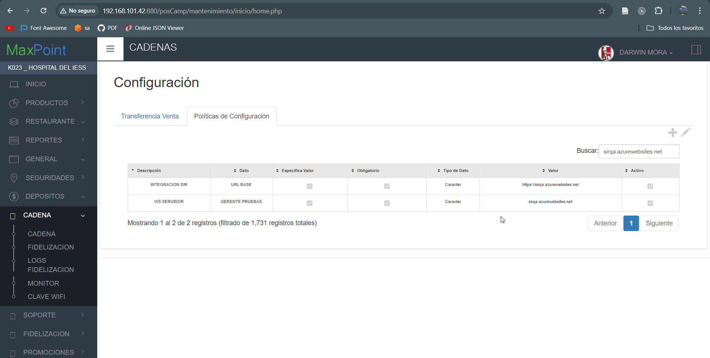

El ambiente de pruebas de SIR proporcionado por el quipo de QA-SIR es: https://sirqa.azurewebsites.net/inicio/home.php.
Las políticas que se deben modificar son: 
* INTERACCION SIR - URL BASE
* WS SERVIDOR - GERENTE PRUEBAS

 Estas políticas deben estar configuradas como se muestra en la siguiente imagen. 

  

