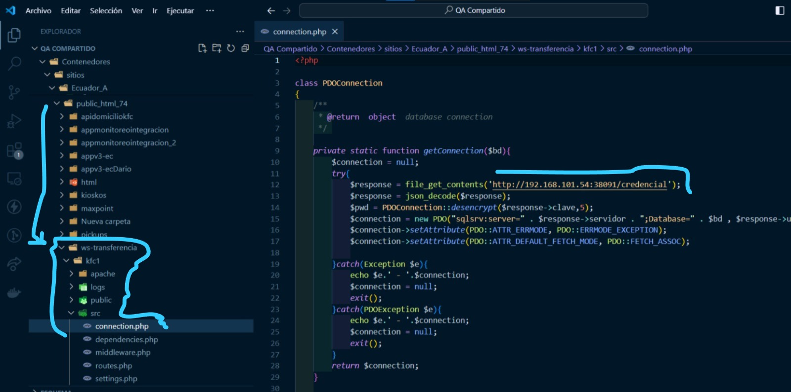

El Web service de transfencia de venta permite interconectar entre una tienda KFC y una HELADERÍA KFC. Existen tiendas que tienen heladerías y estas deben ser configuradas. 

A nivel de restaurante existen las siguientes políticas: 

  

A nivel de cadena existen las siguientes políticas: 

  

 El valor de cada uno de estas políticas depende de la IP del Web service que se esté usando. 

 En el servidor 192.168.101.54 que pertenece a QA Ecuador tenemos dockerizado un ws-transferencia el cuál se puede encontrar en la ruta que está en la imagen. 

   

  En el archivo conection.php se puede cambiar la url de las credenciales. Las credenciales pueden apuntar a la base que nosotros deseamos que apunte

  Adicional se tienen los siguientes puertos para que puedan ser usados en ws-transferencia. 

     

