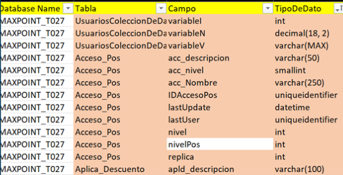
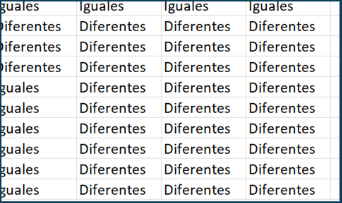
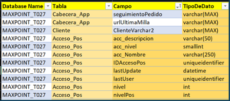
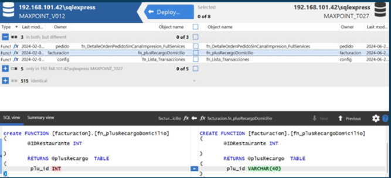

# Estructura de base de datos

 Esto nos ayudar a explicar cómo comparar dos listas de datos en Excel utilizando el formato condicional y la función CONTAR.SI(). Se explica cómo resaltar las celdas que contienen valores que no están presentes en la otra lista, lo que permite identificar fácilmente los elementos faltantes o duplicados entre las dos listas. Se proporcionan ejemplos prácticos, como comparar una nómina con una base de datos, que en este caso sería la **V012** y **T027**.

## Formulas que se pueden utilizar para la comparación de base de datos en excel.

- Esta fórmula es para ver si hay elementos únicos en el grupo de v012 y en el grupo del t027.

```jsx title="Fórmula:"
=SI(CONTAR.SI('script5 Results 1'!$A$3384:$A$6764, 'script5 Results 1'!A2) = 0, 'script5 Results 1'!A2, "")
```
- Esta formula es para ver si los elementos Únicos en el segundo grupo que no están en el primer grupo.

```jsx title="Fórmula:"
=SI(CONTAR.SI('script5 Results 1'!$A$2:$A$3382, 'script5 Results 1'!A3384) = 0, 'script5 Results 1'!A3384, "")
```

# PROCESOS FÓRMULAS.

Con Excel tenemos las siguientes presentaciones de comparar bases

```jsx title="Fórmula:"
=SI(CONTAR.SI('script5 Results 1'!$A$3384:$A$6764, 'script5 Results 1'!A2) = 0, 'script5 Results 1'!A2, "")
```
- El resultado a obtener de la función es si la fórmula verifica si el valor en A2 de la hoja "script5 Results 1" no aparece en el rango de celdas A3384:A6764 de la misma hoja. Si el valor no aparece, la fórmula devuelve el valor de A2. Si el valor aparece al menos una vez en ese rango, la fórmula devuelve una cadena vacía.

## RESULTADO OBTENIDO.

Vemos que nos devuelve un cuadro sin pintar pero nos vamos a la base y revisamos si en vedad ese apartado no hay si existe por lo cual no nos funciona esta función



- Una comparación lógica entre el contenido de dos celdas donde aplicaremos a nuestras bases

```jsx title="Fórmula:"
=C1<>'V012'!C1
```
Resultado a obtener es verificar si el valor en C1 de la hoja actual es diferente del valor en C1 de la hoja V012. Si son diferentes, devuelve VERDADERO. Si son iguales, devuelve FALSO.

## RESULTADO OBTENIDO.

Vemos que en verdad nos trae las diferencias, pero solo palabras, pero no en lo que realmente necesitamos, ya que lo que necesitamos es ver en que no está igual para poder igual.



- La fórmula para la función COINCIDIR y luego comparando su resultado para verificar si es mayor que 0.

```jsx title="Fórmula:"
=COINCIDIR(D2;tipo_dato;0)>0
```

Resultado a Obtener es verificar si el valor en D2 se encuentra en el rango tipo_dato. Si el valor está presente en el rango (lo que significa que COINCIDIR devuelve una posición mayor que 0), la fórmula devuelve VERDADERO. Si el valor no está presente en el rango (lo que significa que COINCIDIR devolvería un error, que es tratado como 0 en esta comparación), la fórmula devuelve FALSO.

## RESULTADO OBTENIDO.

Vemos en vedad si nos devuelve las comparaciones que necesitamos, ya que vamos a la otra base y vemos en realidad eso no hay esos campos donde veríamos ingresar para proseguir nuestra base.



Vemos que nos sale similar a la aplicación sql compare.




