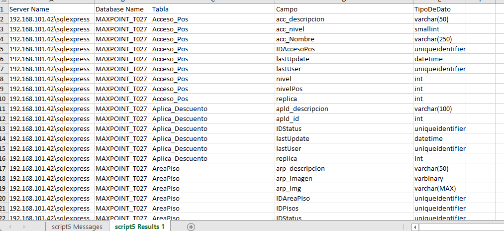
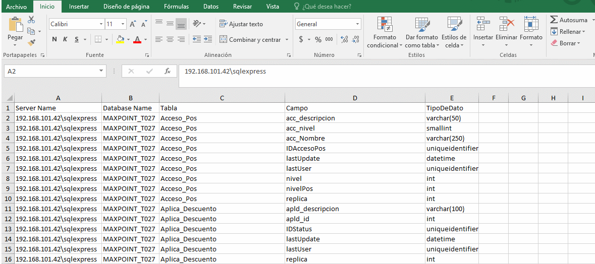
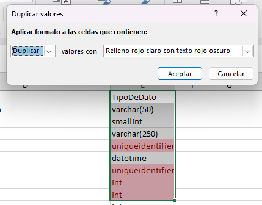

# Uso de FORMATO CONDICIONAL

- **Paso 1: Selecciona el rango de celdas.**

- **Paso 2: Ve a la pestaña "Inicio" y selecciona "Formato Condicional".**

- **Ejemplo:** Aplica formato condicional para resaltar las celdas en "V012" donde el "TipoDeDato" no coincide con el de "T027".

